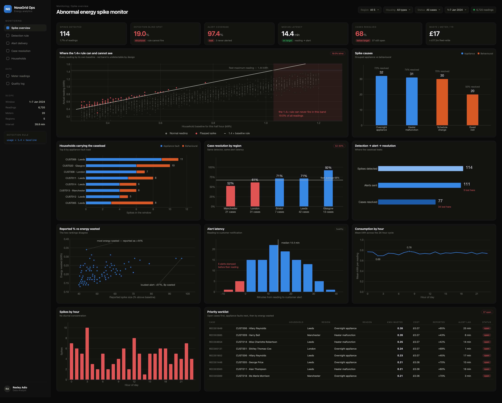
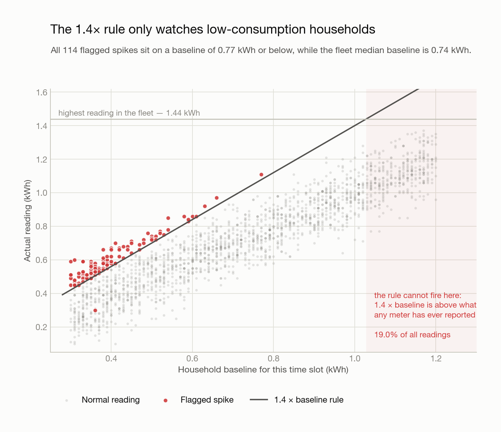
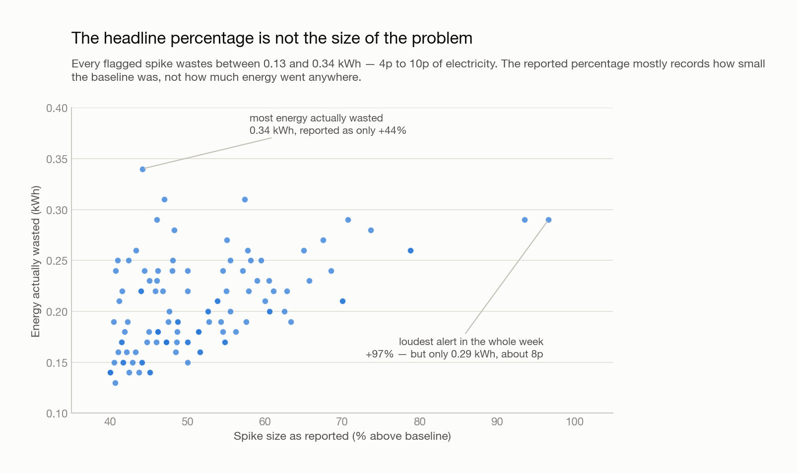
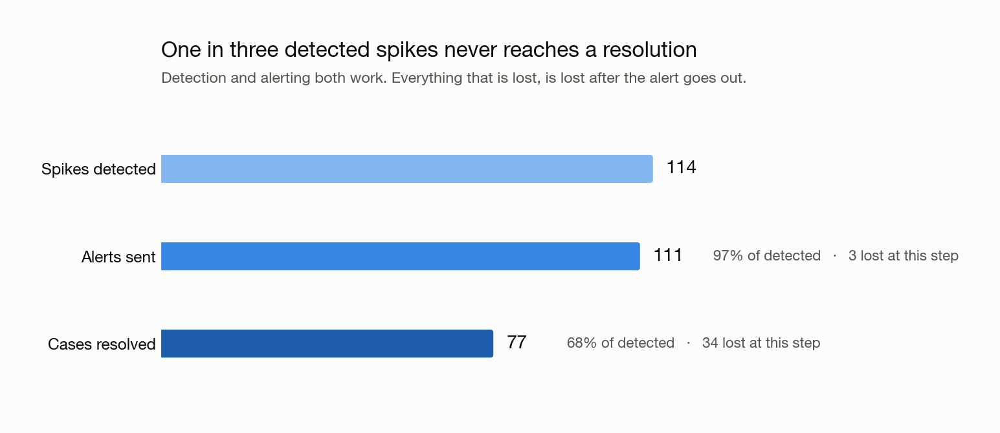
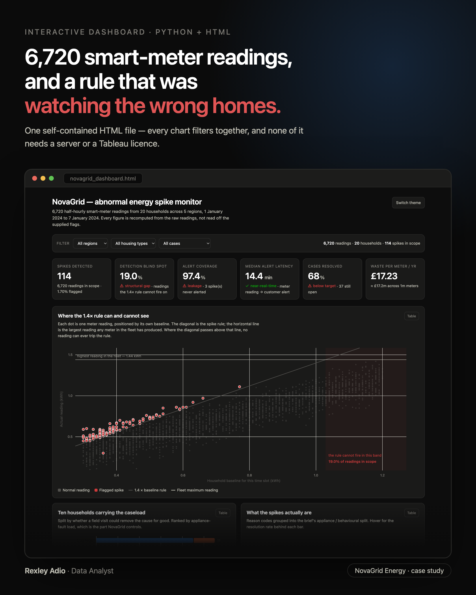

# Detecting Abnormal Energy Spikes — NovaGrid Energy

> The spike detector worked exactly as documented. That was the problem.

[](https://www.python.org/)
[](https://pandas.pydata.org/)
[](https://matplotlib.org/)
[](LICENSE)

An end-to-end analysis of 6,720 half-hourly smart-meter readings: cleaning and a
data-quality audit, an audit of the client's own anomaly-detection rule, an interactive
dashboard built as a single self-contained HTML file, and a written report with
recommendations.

**Case study, not a live system.** The brief and dataset come from an Amdari case study of a
fictional UK energy retailer. The customer names and email addresses in the extract are
synthetic.



---

## Contents

- [The finding](#the-finding)
- [The dashboard](#the-dashboard)
- [Results at a glance](#results-at-a-glance)
- [What's in the repo](#whats-in-the-repo)
- [Running it](#running-it)
- [Method](#method)
- [Limitations](#limitations)

---

## The finding

NovaGrid flags an abnormal spike when a household uses **more than 1.4 × its own baseline**
for that time slot. Over one week the rule flagged 114 readings, alerted on 111 of them
within a median of 14 minutes, and produced zero false alarms. Detection and alerting are
not the weak link.

Three things are.

### 1. The rule is blind to 19% of all readings

Readings in this fleet top out at **1.44 kWh**. So wherever a household's baseline exceeds
**1.03 kWh**, `1.4 × baseline` is higher than anything a meter can physically report — and
the rule cannot fire at any level of consumption.

Every spike the system has ever raised sits on a baseline of 0.77 kWh or below. The fleet
median baseline is 0.74 kWh. **The households that consume the most are the ones the
detector watches least** — the exact opposite of the brief's stated goal of catching faulty
appliances running unnoticed.



### 2. The reported percentage is not the size of the problem

Every flagged spike wasted between **0.13 and 0.34 kWh** — 4p to 10p of electricity. The
loudest alert of the week, at "+97%", was 0.29 kWh on a household with a very small
baseline. Meanwhile **122 readings that were never flagged wasted more than the median
flagged spike did**, and the single largest waste event of the week ranks 85th of 114 by
reported percentage.

Field work is being prioritised by the wrong number. `spike_events.csv` carries both
`waste_rank` and `pct_rank` so the two orderings can be compared directly.



### 3. Detection loses 3%. The operation loses 30%.

114 spikes detected → 111 alerted → **77 resolved**. And the gap is regional: Manchester
closes 52% of its cases, Glasgow 92% — on the same detector, the same alert, and the same
14-minute latency. Manchester actually has the *fastest* alerts of any region.



### The recommendation

Keep the ratio rule. Add an absolute one beside it:

```python
spike = (usage > 1.4 * baseline) or (usage - baseline > 0.30)
```

Ratio catches proportionally large events on small baselines; absolute excess catches
materially large events on **any** baseline. In this week alone the second clause surfaces
five events the current rule ignored, each wasting more energy than 97% of the spikes it did
flag.

Worth stating plainly: **1.4 is a well-chosen multiplier.** Among readings the rule never
flags, `usage ÷ baseline` reaches 1.34 at the 99th percentile and 1.39 at the 99.9th, so a
1.4 cut sits just past the tail of normal variation — lowering it to 1.3 would roughly
double the caseload with statistical noise. The threshold isn't wrong. The *shape* of the
rule is.

Full reasoning, plus five more recommendations, in
**[`05_report/findings_report.md`](05_report/findings_report.md)**.

---

## The dashboard

**[`03_dashboard/novagrid_dashboard.html`](03_dashboard/novagrid_dashboard.html)** — one
self-contained file. Download it and open it; there is no server, no build step and no BI
licence.



The full 6,720-reading dataset is embedded, so it re-aggregates client-side under any filter
combination:

- **Filters** — region, housing type, case status, in one row scoping every chart at once
- **Six KPI tiles** with status flags where a number is off target
- **Seven charts**, each with hover tooltips and a **Table** toggle showing the same numbers
  as text, so nothing is encoded in colour alone
- **Priority worklist** — open cases first, appliance faults next, then by energy wasted
- Light and dark themes, both validated against their chart surface

---

## Results at a glance

| | |
|---|---|
| Readings analysed | **6,720** (from 6,764 raw — 43 duplicates and 1 blank row removed) |
| Households / meters / regions | 20 / 20 / 5 |
| Reading interval | 28.8 minutes — **not** the 30 minutes the brief specifies |
| Spikes detected | **114** (1.70% of readings; all 20 households affected) |
| Readings the rule cannot fire on | **19.0%** |
| Alerts sent | 111 of 114 (97.4%), median latency 14.4 min, max 36 min |
| Cases resolved | 77 of 114 (**67.5%**) |
| Energy wasted by flagged spikes | 23.15 kWh in the week — £6.63 at 28.62 p/kWh |
| Annualised per meter | 60.2 kWh — **£17.23** |

### Data-quality issues found

Thirteen, logged with evidence and treatment in
[`05_report/data_quality_log.md`](05_report/data_quality_log.md). The three that matter most:

- **Two different date formats in one file.** `reading_timestamp` is UK (`DD/MM/YYYY`),
  `alert_time` is US (`M/D/YYYY`). Parsing both with one format raises no error — it just
  silently destroys the alert timeline.
- **`REC000015` is flagged as a spike while sitting 17% *below* its baseline.** It is the
  only record where `spike_detected` disagrees with the rule it is supposed to implement. It
  is reported, not repaired — removing it would hide a live bug.
- **Six alerts are timestamped before the reading that triggered them**, by up to 5.2
  minutes. Clock skew in the alerting service; it makes latency reporting unreliable until
  fixed.

---

## What's in the repo

```
.
├── 00_data_raw/
│   └── smart_meter_dataset.csv   the source extract, vendored so a clone just runs
├── 01_pipeline/
│   ├── novagrid_pipeline.py      cleaning → features → rule audit → aggregates
│   ├── build_charts.py           the eight report charts
│   ├── build_dashboard.py        injects the data into the dashboard template
│   ├── build_linkedin_carousel.py    square carousel PDF + slide PNGs
│   ├── build_linkedin_hero.py        4:5 hero shot of the dashboard
│   └── build_linkedin_poster.py      the all-charts console poster
├── 02_data_outputs/
│   ├── novagrid_clean.csv        6,720 analysis-ready readings
│   ├── spike_events.csv          114 spikes: class, waste, cost, latency, waste_rank vs pct_rank
│   ├── household_scorecard.csv   20 households: spike rate, fault load, coverage, priority
│   ├── kpi_summary.json          every headline number, plus the cleaning and rule-audit logs
│   └── chart_data.json           pre-aggregated series behind the charts
├── 03_dashboard/
│   ├── novagrid_dashboard.html   ← the deliverable (self-contained, ~570 KB)
│   └── dashboard.template.html   source template; data is injected at build time
├── 04_charts/                    eight 160-dpi PNGs sized for 16:9 slides
├── 05_report/
│   ├── findings_report.md        the full analysis
│   ├── data_quality_log.md       13 issues found, and what was done about each
│   └── presentation_script.md    11 slides with speaker notes
└── 06_linkedin/                  poster, carousel PDF, hero images, post copy
```

---

## Running it

```bash
git clone https://github.com/Rexxxie/novagrid-energy-spike-detection.git
cd novagrid-energy-spike-detection
pip install -r requirements.txt

python3 01_pipeline/novagrid_pipeline.py   # → 02_data_outputs/
python3 01_pipeline/build_charts.py        # → 04_charts/
python3 01_pipeline/build_dashboard.py     # → 03_dashboard/novagrid_dashboard.html
```

Every number in every report, chart and slide traces back to
`02_data_outputs/kpi_summary.json`. Nothing is typed by hand, so the whole project
regenerates from the raw CSV with those three commands.

The three `build_linkedin_*.py` scripts additionally need **Google Chrome** (used headlessly
to rasterise HTML) and **Pillow**. They are optional and only produce presentation assets.

---

## Method

- **The supplied flag was not trusted.** `spike_detected` was re-derived from
  `energy_usage_kWh > 1.4 × baseline_kWh` and reconciled against the vendor column: 113 of
  114 match exactly, with zero false negatives.
- **Cleaning decisions are logged and reversible.** Issues that are defects in the source
  system — the mis-flagged record, the clock skew, the missed notifications — are reported
  rather than silently repaired.
- **Money** is converted at **28.62 p/kWh**, the Ofgem electricity price cap for Jan–Mar
  2024. The fleet-scale figure assumes 1m meters (from the brief's company overview) and is
  an illustration of magnitude, not a forecast.
- **Colour** follows a CVD-validated palette. Categorical hues are assigned by entity and
  never by rank; red and green are reserved for status (anomaly, resolved) and never used to
  identify a series. The worst adjacent pair measures ΔE 24.7 under protanopia simulation
  and 33.6 at normal vision — both passing on the chart surface.
- **No dual-axis charts.** Where two measures of different scale needed comparing, they are
  faceted into two panels sharing an x-axis.

---

## Limitations

Stated up front, because they bound what the analysis can support:

- **Seven days, 20 households, one January week.** Enough to audit a detection rule and size
  an operational gap. Not enough for seasonality, consumption modelling or forecasting —
  which is why no trend claim appears anywhere in this work.
- **The supplied `baseline_kWh` is not what the brief describes.** The brief calls it a
  4-week average for the same time slot; in the data it changes daily, and the extract is
  only 7 days long. It is used as given, and the mismatch is recorded.
- **"Resolved" is an unverified status.** There is no case-outcome data — what the engineer
  found, whether the spike recurred — so the effectiveness of the programme itself cannot be
  measured here.
- **No complaint log.** The brief frames the project around customer complaints, but nothing
  in the extract joins to one. The central business claim — that spike detection reduces
  complaints — is untested by this data.
- **Two claims are explicitly unsupported** and are reported as such rather than quietly
  omitted: there is no peak-hour concentration (mean consumption varies 12% across the whole
  24-hour cycle) and no meaningful housing-type effect.

---

## Licence

[MIT](LICENSE) for the code. The dataset and case-study brief belong to their original
authors and are included here for reproducibility.
